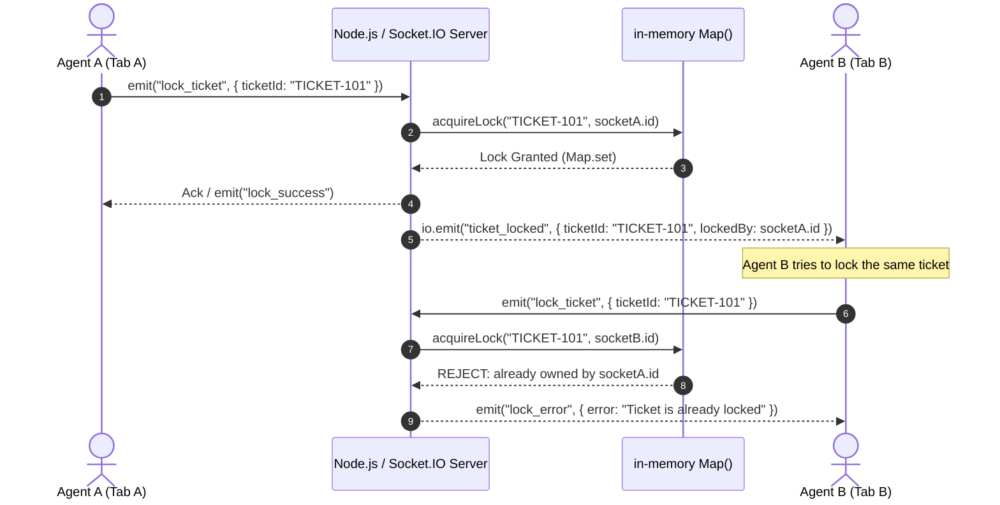
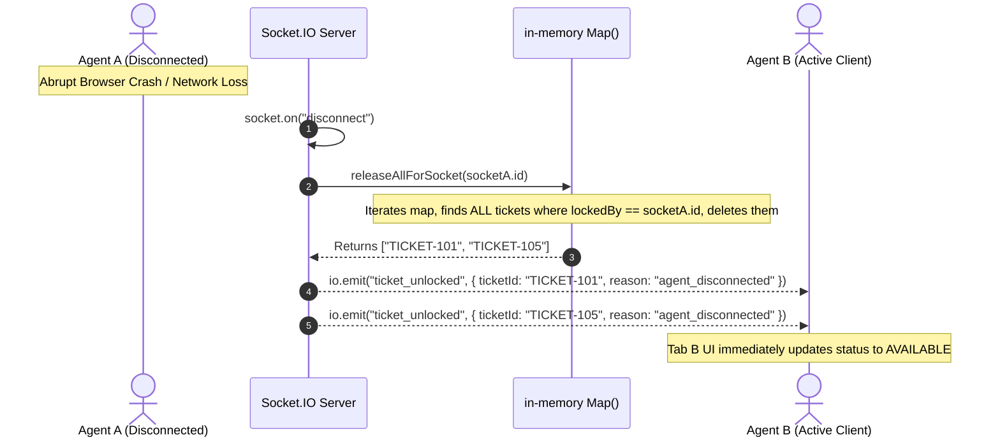

# 🎟️ Real-Time Ticket Locking System

> A production-ready, bulletproof real-time Ticket Locking System built with **Node.js**, **Express.js**, and **Socket.IO**, designed to serve as the single source of truth for ticket locks and handle ghost/abrupt disconnects reliably.

---

## 🌟 Key Features

- **⚡ Authoritative In-Memory Concurrency**: Uses an in-memory JavaScript `Map` (`ticketLocks = new Map()`) for atomic check-and-set operations, guaranteeing zero race conditions and eliminating database locking overhead.
- **👻 Bulletproof Ghost Disconnect Handling**: Automatically detects abrupt disconnects (crashes, network drops, closing laptop/browser) and releases **all** tickets owned by that socket ID immediately.
- **🔄 Real-Time Multi-Agent Synchronization**: Broadcasts lock and unlock states to all connected dashboard clients instantly.
- **🛡️ Strict Ownership & Validation**: Only the socket that acquired a lock can release it. Duplicate lock attempts and unauthorized releases are rejected.
- **📊 Interactive Client Dashboard**: Built-in modern UI with real-time stats, interactive cards for tickets (`TICKET-101` to `TICKET-105`), custom ticket input, live event audit log, and a **"Simulate Ghost Drop"** button.
- **🩺 REST Debugging Endpoints**: Includes `GET /api/health` and `GET /api/ticket-locks` for health checks and state inspection.
- **🧪 100% Automated Test Coverage**: End-to-end socket testing for lock acquisition, rejection, unlocks, ghost releases, multi-ticket disconnects, and simultaneous race conditions.

---

## 📁 Project Structure

```
.
├── src/
│   ├── server.js              # Express app + HTTP server + Socket.IO initialization
│   ├── socket/
│   │   └── ticketSocket.js    # Real-time event handlers & ghost disconnect logic
│   ├── state/
│   │   └── ticketLocks.js     # In-memory Map state manager & lock operations
│   ├── routes/
│   │   └── health.js          # REST endpoints (/api/health, /api/ticket-locks)
│   └── utils/
│       └── validation.js      # Input sanitization and ticketId validation
├── public/
│   ├── index.html             # Client dashboard interface
│   ├── style.css              # Modern dark-mode styling & animations
│   └── app.js                 # Frontend Socket.IO client logic
├── test/
│   └── ticket-locking.test.js # Automated test runner (10 test suites)
├── .env                       # Environment configuration
├── package.json
└── README.md
```

---

## 🚀 Quick Start

### 1. Install Dependencies

```bash
npm install
```

### 2. Start the Server

```bash
# Production mode
npm start

# Development mode with hot-reload
npm run dev
```

The server starts on `http://localhost:3000` (or the port defined in `.env`).

---

## 🔌 Socket.IO Event Reference

### Client-to-Server Events

| Event | Payload | Description |
| :--- | :--- | :--- |
| `join_dashboard` | `(optional Ack Callback)` | Announces client presence and requests active lock snapshot. |
| `lock_ticket` | `{ ticketId: string }` | Attempts to lock a ticket for the current `socket.id`. |
| `unlock_ticket` | `{ ticketId: string }` | Releases a lock owned by the current `socket.id`. |

### Server-to-Client Events

| Event | Payload | Trigger / Purpose |
| :--- | :--- | :--- |
| `current_ticket_locks` | `{ locks: { [ticketId]: socketId }, timestamp }` | Sent to a newly joined client on `join_dashboard`. |
| `ticket_locked` | `{ ticketId: string, lockedBy: string, timestamp }` | Broadcast to **all** clients when a ticket is locked. |
| `ticket_unlocked` | `{ ticketId: string, reason: string, ... }` | Broadcast to **all** clients when a ticket is unlocked (manual or ghost). |
| `lock_error` | `{ success: false, error: string, ticketId, lockedBy }` | Sent to the requester if a lock fails or is already taken. |
| `unlock_error` | `{ success: false, error: string, ticketId, lockedBy }` | Sent to the requester if unlock fails (e.g. unauthorized). |

---

## 🔄 Lock Lifecycle & Concurrency Architecture



---

## 👻 Ghost Disconnect Handling

When an agent experiences sudden connection loss (e.g. WiFi cut, laptop lid closed, tab killed without unlocking):



### Key Implementation:
```javascript
socket.on("disconnect", (reason) => {
  const releasedTicketIds = releaseAllForSocket(socket.id);
  for (const ticketId of releasedTicketIds) {
    io.emit("ticket_unlocked", {
      ticketId,
      reason: "agent_disconnected",
      previousOwner: socket.id,
      timestamp: new Date().toISOString()
    });
  }
});
```

---

## 🧪 Testing

### Automated Test Suite

Run the full end-to-end automated test suite:

```bash
npm test
```

This verifies:
1. ✅ **Successful lock** acquires lock and broadcasts `ticket_locked`.
2. ✅ **Duplicate lock rejection** prevents multiple agents locking the same ticket.
3. ✅ **Successful unlock** by lock owner releases lock and broadcasts `ticket_unlocked`.
4. ✅ **Unauthorized unlock rejection** prevents non-owners from unlocking tickets.
5. ✅ **Ghost Disconnect Single Ticket**: Closing a client releases its locked ticket.
6. ✅ **Ghost Disconnect Multiple Tickets**: Closing a client releases ALL tickets held by it.
7. ✅ **Multi-Client Broadcast**: All connected clients receive instant lock updates.
8. ✅ **Dashboard Synchronization**: `join_dashboard` sends complete active lock snapshot.
9. ✅ **Input Validation**: Empty or invalid `ticketId` payloads are rejected without crashing.
10. ✅ **Simultaneous Race Condition**: Simultaneous lock requests are atomically resolved.

---

## 🖥️ Manual Verification Tutorial (2 Browser Tabs)

1. Start the server (`npm start`) and open `http://localhost:3000` in **Tab A**.
2. Open `http://localhost:3000` in **Tab B** side-by-side.
3. In **Tab A**, click **Lock Ticket** on `TICKET-101`.
   - In Tab A: Status becomes **"Locked by You"** with an **"Unlock Ticket"** button.
   - In Tab B: Status instantly changes to **"Locked"** (showing Tab A's socket ID) and lock/unlock buttons are disabled.
4. Try to click unlock in Tab B — action is blocked.
5. **Simulate Crash / Disconnect**:
   - In Tab A, click **"Simulate Ghost Drop"** (or simply close Tab A).
   - In Tab B, observe `TICKET-101` immediately turn **"Available"** with green badge, and the Real-Time Event Stream displays `🚨 GHOST RELEASE: [TICKET-101] released (Agent disconnected)`.
6. Tab B can now lock `TICKET-101` immediately!

---

## 🩺 REST Endpoints

### 1. Health Check
```http
GET /api/health
```
**Response:**
```json
{
  "success": true,
  "message": "Real-time ticket server is running",
  "timestamp": "2026-09-16T04:51:00.000Z"
}
```

### 2. Inspect In-Memory Locks (Debug)
```http
GET /api/ticket-locks
```
**Response:**
```json
{
  "success": true,
  "activeLocksCount": 2,
  "locks": {
    "TICKET-101": "h4B3F1m...",
    "TICKET-104": "z9K1A8v..."
  },
  "timestamp": "2026-09-16T04:51:00.000Z"
}
```
